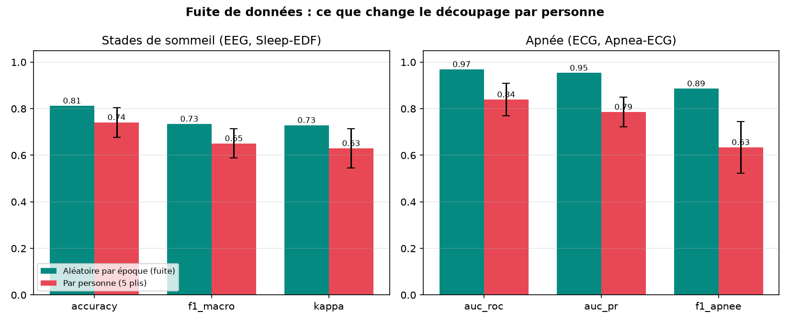

# Somnia — analyse automatique du sommeil, mesurée honnêtement

> Un médecin généraliste formé à la polysomnographie met environ **quatre heures** à lire
> une nuit d'enregistrement. Somnia explore ce qu'un modèle peut pré-trier pour réduire
> ce temps : stades de sommeil à partir de l'EEG, apnées à partir de l'ECG, et à terme une
> file de relecture triée par incertitude.

**Projet de recherche et de formation. Ce n'est pas un dispositif médical : aucune sortie
ne doit servir à un diagnostic.**

Marine Deldicque — projet démarré au bootcamp Jedha (AIA 2026), poursuivi depuis.

---

## État du projet (octobre 2026)

| Composant | État |
|---|---|
| Modèles | Deux Random Forest sur 16 caractéristiques (EEG → 5 stades ; ECG → apnée / normal) |
| Données | PhysioNet : Sleep-EDF (16 personnes, 28 nuits) et Apnea-ECG (31 enregistrements) |
| Mesure | **Validation croisée par personne**, 5 plis. Chiffres ci-dessous |
| Découpage | Par personne, figé dans `data/splits/physionet_v1.json`, vérifié par un test automatique |
| API | FastAPI, déployée sur HuggingFace : [somnia-api](https://huggingface.co/spaces/marinedde/somnia-api) |
| Démo | Streamlit : [somnia-dashboard](https://huggingface.co/spaces/marinedde/somnia-dashboard), signaux PhysioNet uniquement |
| Suite | Passage à SHHS (plusieurs milliers de nuits), réseau convolutif, pré-entraînement auto-supervisé : voir [docs/PLAN_REPRISE.md](docs/PLAN_REPRISE.md) |

---

## Résultats

Même modèle, mêmes caractéristiques, mêmes données. Seul le découpage change.
Tableau complet, par pli et par stade : [docs/RESULTATS.md](docs/RESULTATS.md).

| Tâche | Métrique | Avant : découpage par époque (fuite) | **Après : par personne, 5 plis** |
|---|---|---|---|
| Stades (EEG) | Exactitude | 0,81 | **0,74 ± 0,06** |
| Stades (EEG) | Kappa de Cohen | 0,73 | **0,63 ± 0,08** |
| Stades (EEG) | F1 macro | 0,74 | **0,65 ± 0,06** |
| Apnée (ECG) | AUC-ROC | 0,97 | **0,84 ± 0,07** |
| Apnée (ECG) | Aire précision-rappel | 0,95 | **0,79 ± 0,07** |
| Apnée (ECG) | F1 apnée | 0,89 | **0,63 ± 0,11** |



Les écarts-types sont grands : chaque pli ne met de côté que 3 à 4 personnes (EEG) ou 6
(ECG). C'est l'incertitude réelle de ce qu'on peut affirmer avec si peu de personnes, et
la raison principale du passage à SHHS.

Le stade N1 reste mal reconnu (F1 0,37), comme chez les modèles publiés et chez les
scoreurs humains.

### Références sur SHHS, et validation externe (octobre 2026)

Mêmes 16 caractéristiques, même Random Forest, entraîné sur les 192 personnes d'entraînement
SHHS et mesuré sur les 40 de validation. **Le test SHHS reste fermé** jusqu'à la fin du projet.
Tableau complet : [docs/RESULTATS_SHHS.md](docs/RESULTATS_SHHS.md).

| Tâche | Modèle | Mesuré sur | Métrique | Score |
|---|---|---|---|---|
| Stades | classe majoritaire | SHHS val | exactitude / kappa | 0,41 / 0,00 |
| Stades | RF entraîné sur SHHS | SHHS val | exactitude / kappa | **0,70 / 0,60** |
| Stades | RF entraîné sur SHHS | PhysioNet, tout (externe) | exactitude / kappa | 0,55 / 0,40 |
| Stades | RF entraîné sur PhysioNet | SHHS val (externe) | exactitude / kappa | 0,57 / 0,39 |
| Apnée | classe majoritaire | SHHS val | AUC-ROC / aire PR | 0,50 / 0,43 |
| Apnée | RF entraîné sur SHHS | SHHS val | AUC-ROC / aire PR | **0,65 / 0,56** |
| Apnée | RF entraîné sur SHHS | PhysioNet, tout (externe) | AUC-ROC / aire PR | 0,71 / 0,60 |
| Apnée | RF entraîné sur PhysioNet | SHHS val (externe) | AUC-ROC / aire PR | 0,57 / 0,49 |

Ce que ces lignes disent :

- **La validation externe fait chuter les stades de 0,70 à 0,55** dans les deux sens. Autre
  dérivation EEG (C4-A1 contre Fpz-Cz), autres appareils, autre population : c'est l'écart
  qu'un clinicien verrait en changeant de centre.
- **L'apnée depuis l'ECG seul est difficile sur SHHS** : AUC 0,65 contre 0,84 sur Apnea-ECG.
  Les hypopnées dominent les étiquettes SHHS, la population est générale et enregistrée à
  domicile, et 16 caractéristiques de variabilité cardiaque sur 60 s n'y suffisent pas. C'est
  le chiffre à battre pour le réseau convolutif et le pré-entraînement.
- Deux défauts trouvés en route, qui changeaient tout : l'ECG de SHHS est **inversé** dans la
  plupart des nuits (le détecteur de pics R ne cherchait que des pics positifs), et le
  détecteur maison voyait trois fois trop de variabilité RR. Remplacé par celui de `sleepecg`,
  sur PhysioNet aussi : l'AUC par personne y passe de 0,77 à 0,84 avec les mêmes données.

---

## Fuite de données : ce que j'ai trouvé et corrigé

Les premières versions du projet découpaient les données **par époque** avec
`train_test_split`. Deux fuites en découlaient :

1. **Deux nuits par personne.** Dans Sleep-EDF, `SC4011E0` et `SC4012E0` sont la même
   personne, nuits 1 et 2. Avec un découpage par époque, le modèle apprenait la nuit 1 et
   était évalué sur la nuit 2 de la même personne. Les 28 enregistrements sont en réalité
   16 personnes.
2. **Époques voisines.** Deux époques consécutives de la même nuit se ressemblent
   beaucoup. Réparties au hasard entre entraînement et test, elles font croire à une
   généralisation qui n'existe pas. Pour l'ECG, l'effet est massif : AUC 0,97 → 0,84.

Ce qui a été fait :

- une fonction unique donne l'identifiant de la **personne** pour tout fichier
  (`somnia/subjects.py`), y compris le doublon documenté c05 = c06 d'Apnea-ECG ;
- l'extraction garde cet identifiant à côté de chaque époque (`python_scripts/prepare_features.py`) ;
- le découpage est tiré une fois, par personne, avec une graine, et versionné
  (`python_scripts/make_split.py` → `data/splits/physionet_v1.json`) ;
- un test automatique échoue si une personne se trouve dans deux ensembles
  (`tests/test_split.py`) ; il refuse aussi l'ancien découpage ;
- les chiffres affichés par l'API (`/model-info`) sont ceux de la validation croisée par
  personne, lus dans `models/training_metrics.json`, plus rien n'est codé en dur ;
- la courbe ROC « avant » est désormais calculée, pas dessinée
  (`data/figures/fuite_roc_ecg.png`).

Apnea-ECG contient 35 enregistrements issus de 32 personnes, mais PhysioNet ne publie pas
la correspondance : le découpage ECG est donc par enregistrement, avec c05 et c06 dans le
même groupe. Une fuite résiduelle entre deux enregistrements d'une même personne reste
possible et sera levée par SHHS, où l'identifiant de participant est connu.

---

## Données

Les données ne sont pas dans le dépôt.

| Jeu | Source | Ce qui est utilisé |
|---|---|---|
| Sleep-EDF Expanded | [PhysioNet](https://physionet.org/content/sleep-edfx/1.0.0/) | 28 nuits `SC*`, canal EEG Fpz-Cz à 100 Hz, époques de 30 s, 5 stades (3 et 4 fusionnés en N3). L'éveil avant l'endormissement et après le réveil est retiré |
| Apnea-ECG | [PhysioNet](https://physionet.org/content/apnea-ecg/1.0.0/) | 31 enregistrements avec annotations, ECG à 100 Hz, minutes étiquetées apnée / normal |
| SHHS | [NSRR](https://sleepdata.org/datasets/shhs) | Visite 1, nuits 200001 à 200300 : EEG C4-A1 et ECG ramenés à 100 Hz, époques de 30 s, stades et événements des XML NSRR. Aucune donnée SHHS n'est, ni ne sera, dans ce dépôt ou dans la démo |

Placer les fichiers Sleep-EDF dans `data/raw/` et Apnea-ECG dans `data/raw_apnea/`. Les
fichiers SHHS vivent hors du dépôt (`~/data/shhs`, voir `python_scripts/shhs_download.py`).

### Cohorte SHHS (octobre 2026)

Règles d'exclusion écrites avant de regarder les résultats : fichier illisible, canal EEG ou
ECG absent, moins de 4 h de sommeil scoré, ECG plat sur plus de 50 % des époques.

```
 Nuits téléchargées (shhs1-200001 à 200300, 3 identifiants inexistants)   n = 297
     │
     ├─ retirées : fichier illisible                                       n = 0
     ├─ retirées : canal EEG ou ECG absent                                 n = 0
     ├─ retirées : moins de 4 h de sommeil scoré                           n = 25
     ├─ retirées : ECG plat sur plus de 50 % des époques                   n = 0
     │
 Nuits retenues = personnes (une nuit par personne en visite 1)            n = 272
 Époques de 30 s : 272 598, dont 73 324 avec apnée ou hypopnée (27 %)
     │
     ├─ entraînement                                                       n = 192
     ├─ validation                                                         n = 40
     └─ test (ouvert une fois, à la fin)                                   n = 40
```

Le découpage est fait par personne, une fois, avec une graine fixe, stratifié sur la charge
d'événements respiratoires (apnées et hypopnées annotées par heure de sommeil : < 5, 5-15,
15-30, ≥ 30). Le fichier de découpage contient des identifiants de participants et reste hors
du dépôt ; seuls les effectifs sont publiés.

Deux précisions honnêtes :

- L'étiquette « apnée » d'une époque compte les apnées obstructives, centrales et mixtes
  **et les hypopnées**, dès que ces événements couvrent au moins 10 s des 30 s. Les hypopnées
  sont dix fois plus nombreuses que les apnées obstructives : ce choix pèse lourd.
- La charge d'événements calculée depuis les annotations NSRR (médiane 40 par heure dans
  cette cohorte) est **plus élevée que l'index clinique** publié par SHHS, qui ne compte les
  hypopnées qu'avec une désaturation associée. Elle sert ici à stratifier, pas à poser un
  diagnostic. L'index clinique et les covariables (âge, sexe, IMC) seront pris dans les
  tables SHHS pour les analyses par sous-groupe.

---

## Reproduire

```bash
python3 -m venv .venv && source .venv/bin/activate
pip install -r requirements-research.txt

python python_scripts/prepare_features.py   # caractéristiques + personne, pour les deux tâches
python python_scripts/make_split.py         # découpage par personne (une fois ; v1 déjà versionnée)
python python_scripts/evaluate_cv.py        # validation croisée par personne → docs/RESULTATS.md
python python_scripts/retrain.py            # réentraîne, garde-fou sur la validation, écrit models/
pytest                                      # 65 tests dont découpage, hygiène du dépôt, API
```

`retrain.py` refuse d'écrire un modèle si, sur les personnes de validation, le kappa EEG
passe sous 0,50 ou l'AUC ECG sous 0,65.

---

## API

```bash
uvicorn app.main:app --reload     # documentation interactive sur /docs
```

| Endpoint | Rôle |
|---|---|
| `POST /predict/sleep-stage` | 3 000 points d'EEG (30 s à 100 Hz) → stade + probabilités |
| `POST /predict/apnea` | 6 000 points d'ECG (60 s à 100 Hz) → apnée / normal + probabilités |
| `GET /model-info` | Métriques par personne, écart-type, chiffres « avant fuite » pour comparaison |
| `GET /monitoring/drift/features?task=…` | Dérive des caractéristiques par rapport à l'entraînement |
| `POST /validations` | Trace des validations faites par un clinicien |

Déploiement : à chaque push sur `main`, la CI teste puis déploie les deux Spaces par liste
blanche (`python_scripts/deploy_hf.py`) : seuls les fichiers nécessaires y sont envoyés.

---

## Organisation du dépôt

```
somnia/              code de la chaîne de données : identifiant personne, lecture PhysioNet,
                     découpage, évaluation par personne
app/                 API FastAPI et extracteurs de caractéristiques (les mêmes qu'à l'entraînement)
python_scripts/      prepare_features, make_split, evaluate_cv, retrain, deploy_hf, shhs_download
tests/               API, découpage, identifiants, hygiène du dépôt (aucun fichier SHHS ni jeton)
data/splits/         découpage par personne, versionné
docs/                PLAN_REPRISE.md (plan en 7 étapes), RESULTATS.md (généré), ROADMAP_V3.md
notebooks/           exploration et préparation d'origine ; la référence est désormais python_scripts/
JOURNAL.md           journal de bord
```

---

## Limites connues

- 16 et 30 personnes : trop peu pour conclure. Les intervalles sont larges.
- Un seul canal EEG, un seul canal ECG. Pas de contexte temporel : chaque époque est
  classée seule, ce qui plafonne le stade N1 et les transitions.
- Populations PhysioNet : volontaires sains (Sleep-EDF) et patients sélectionnés
  (Apnea-ECG). Pas de validation sur une autre population : c'est l'objet de SHHS.
- Les probabilités ne sont pas calibrées. Le tri par incertitude attendra la calibration.
- Non évalué chez les porteurs de stimulateur cardiaque ni en fibrillation auriculaire,
  où un modèle fondé sur la variabilité du rythme a toutes les raisons d'échouer.

---

## Citations

- Kemp B. et al., *Sleep-EDF Database Expanded*, PhysioNet.
- Penzel T. et al., *The Apnea-ECG Database*, PhysioNet.
- Goldberger A. et al., *PhysioBank, PhysioToolkit, and PhysioNet*, Circulation 2000.
- Sleep Heart Health Study, National Sleep Research Resource (NSRR), à citer dès la première utilisation.
