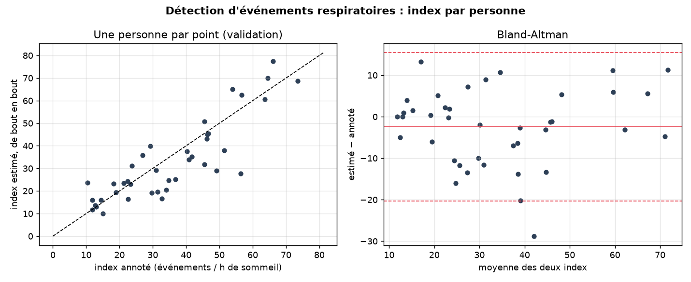
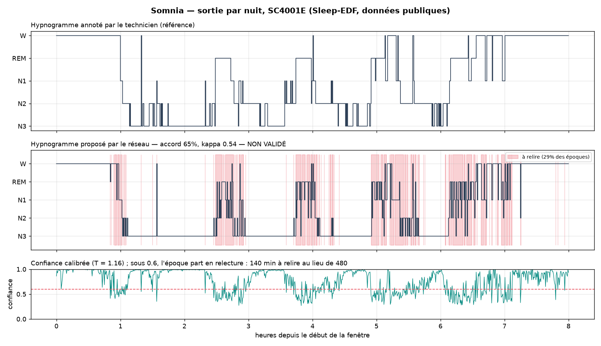

# Somnia — analyse automatique du sommeil, mesurée honnêtement

> Un médecin généraliste formé à la polysomnographie met environ **quatre heures** à lire
> une nuit d'enregistrement. Somnia explore ce qu'un modèle peut pré-trier pour réduire
> ce temps : stades de sommeil à partir de l'EEG, apnées à partir de l'ECG, et à terme une
> file de relecture triée par incertitude.

**Projet de recherche et de formation. Ce n'est pas un dispositif médical : aucune sortie
ne doit servir à un diagnostic.**

Marine Deldicque — projet démarré au bootcamp Jedha (AIA 2026), poursuivi depuis.

---

## État du projet (octobre 2026)

| Composant | État |
|---|---|
| Modèles | Deux Random Forest sur 16 caractéristiques (EEG → 5 stades ; ECG → apnée / normal) |
| Données | PhysioNet : Sleep-EDF (16 personnes, 28 nuits) et Apnea-ECG (31 enregistrements) |
| Mesure | **Validation croisée par personne**, 5 plis. Chiffres ci-dessous |
| Découpage | Par personne, figé dans `data/splits/physionet_v1.json`, vérifié par un test automatique |
| API | FastAPI, déployée sur HuggingFace : [somnia-api](https://huggingface.co/spaces/marinedde/somnia-api) |
| Démo | Streamlit : [somnia-dashboard](https://huggingface.co/spaces/marinedde/somnia-dashboard), signaux PhysioNet uniquement |
| Fiche modèle | [docs/FICHE_MODELE.md](docs/FICHE_MODELE.md) : usage prévu, usages exclus, populations non couvertes, limites |
| Test final | SHHS test ouvert **une seule fois**, le 3 octobre : [docs/RESULTATS_TEST.md](docs/RESULTATS_TEST.md) |
| Suite | Contexte temporel sur la nuit, qualité du signal, EOG et EMG, deuxième cohorte NSRR, apnée avec la saturation |

---

## Résultats

Même modèle, mêmes caractéristiques, mêmes données. Seul le découpage change.
Tableau complet, par pli et par stade : [docs/RESULTATS.md](docs/RESULTATS.md).

| Tâche | Métrique | Avant : découpage par époque (fuite) | **Après : par personne, 5 plis** |
|---|---|---|---|
| Stades (EEG) | Exactitude | 0,81 | **0,74 ± 0,06** |
| Stades (EEG) | Kappa de Cohen | 0,73 | **0,63 ± 0,08** |
| Stades (EEG) | F1 macro | 0,74 | **0,65 ± 0,06** |
| Apnée (ECG) | AUC-ROC | 0,97 | **0,84 ± 0,07** |
| Apnée (ECG) | Aire précision-rappel | 0,95 | **0,79 ± 0,07** |
| Apnée (ECG) | F1 apnée | 0,89 | **0,63 ± 0,11** |


Les écarts-types sont grands : chaque pli ne met de côté que 3 à 4 personnes (EEG) ou 6
(ECG). C'est l'incertitude réelle de ce qu'on peut affirmer avec si peu de personnes, et
la raison principale du passage à SHHS.

Le stade N1 reste mal reconnu (F1 0,37), comme chez les modèles publiés et chez les
scoreurs humains.

### Références sur SHHS, et validation externe (octobre 2026)

Mêmes 16 caractéristiques, même Random Forest, entraîné sur les 192 personnes d'entraînement
SHHS et mesuré sur les 40 de validation. **Le test SHHS reste fermé** jusqu'à la fin du projet.
Tableau complet : [docs/RESULTATS_SHHS.md](docs/RESULTATS_SHHS.md).

| Tâche | Modèle | Mesuré sur | Métrique | Score |
|---|---|---|---|---|
| Stades | classe majoritaire | SHHS val | exactitude / kappa | 0,41 / 0,00 |
| Stades | RF entraîné sur SHHS | SHHS val | exactitude / kappa | **0,70 / 0,60** |
| Stades | RF entraîné sur SHHS | PhysioNet, tout (externe) | exactitude / kappa | 0,55 / 0,40 |
| Stades | RF entraîné sur PhysioNet | SHHS val (externe) | exactitude / kappa | 0,57 / 0,39 |
| Apnée | classe majoritaire | SHHS val | AUC-ROC / aire PR | 0,50 / 0,43 |
| Apnée | RF entraîné sur SHHS | SHHS val | AUC-ROC / aire PR | **0,65 / 0,56** |
| Apnée | RF entraîné sur SHHS | PhysioNet, tout (externe) | AUC-ROC / aire PR | 0,71 / 0,60 |
| Apnée | RF entraîné sur PhysioNet | SHHS val (externe) | AUC-ROC / aire PR | 0,57 / 0,49 |

### Réseau convolutif sur le signal brut (étape 4, octobre 2026)

Même découpage, même validation, test toujours fermé. Réseau 1D de 70 000 paramètres, une
époque à la fois, normalisation par exemple, test du petit lot réussi avant tout entraînement.
Tableau complet, calibration et courbes : [docs/RESULTATS_CNN.md](docs/RESULTATS_CNN.md).

| Tâche | Modèle | Personnes étiquetées | Métrique | Score (validation) |
|---|---|---|---|---|
| Stades | Random Forest | 192 | exactitude / kappa | 0,70 / 0,60 |
| Stades | **CNN 1D** | 192 (100 %) | exactitude / kappa | **0,73 / 0,64** |
| Stades | CNN 1D | 19 (10 %) | exactitude / kappa | 0,68 / 0,56 |
| Stades | CNN 1D | 2 (1 %) | exactitude / kappa | 0,37 / 0,22 |
| Apnée | Random Forest | 192 | AUC-ROC / aire PR | **0,65 / 0,56** |
| Apnée | CNN 1D | 192 (100 %) | AUC-ROC / aire PR | 0,63 / 0,54 |
| Apnée | CNN 1D | 19 (10 %) | AUC-ROC / aire PR | 0,48 / 0,41 |

- **Stades** : le réseau dépasse la forêt (kappa 0,64 contre 0,60) et sa faim d'étiquettes est
  nette : 19 personnes suffisent presque, 2 ne suffisent pas. En refusant la moitié des époques
  les moins sûres, l'exactitude monte à 0,89 : c'est le principe de la file de relecture.
- **Apnée** : le réseau sur 60 s d'ECG brut **ne bat pas** la forêt sur 16 caractéristiques, et
  n'ordonne pas mieux les personnes (Spearman 0,07 avec l'index clinique). Soixante secondes
  d'ECG ne suffisent pas à voir une hypopnée : le signe est dans la variation du rythme sur
  plusieurs minutes et dans la saturation. C'est un résultat, et il oriente la suite :
  contexte plus long, et le pré-entraînement de l'étape 5 là où les étiquettes manquent.

### Pré-entraînement auto-supervisé (étape 5, octobre 2026)

L'encodeur est d'abord entraîné **sans aucune étiquette** à reconnaître deux vues transformées
d'une même époque parmi celles d'autres personnes (InfoNCE, lots d'une époque par personne),
sur les signaux des 192 personnes d'entraînement. Les transformations ont été choisies avec un
critère clinique : bruit léger, amplitude, décalage, masquage court, inversion de signe pour
l'ECG ; ni inversion temporelle, ni étirement (il change la fréquence cardiaque, qui est le
signe recherché). Puis sonde linéaire (encodeur gelé) et affinage. Détail : [docs/RESULTATS_CNN.md](docs/RESULTATS_CNN.md).

| Tâche | Personnes étiquetées | De zéro | Pré-entraîné, affiné | Sonde linéaire (gelé) |
|---|---|---|---|---|
| Stades, kappa | 2 (1 %) | 0,25 ± 0,12 | **0,37 ± 0,08** | — |
| Stades, kappa | 19 (10 %) | 0,58 ± 0,02 | 0,58 ± 0,01 | 0,54 |
| Stades, kappa | 192 (100 %) | 0,64 ± 0,01 | 0,64 ± 0,02 | 0,57 |
| Apnée, AUC-ROC | 19 (10 %) | 0,48 | 0,50 | 0,49 |
| Apnée, AUC-ROC | 192 (100 %) | 0,63 | 0,63 | 0,55 |

Conclusion, en cinq lignes :

1. Avec 1 % des étiquettes, le pré-entraînement fait passer le kappa des stades de 0,25 à 0,37 en
   moyenne sur trois graines ; avec 10 % et plus, l'écart disparaît. C'est cohérent avec la littérature : l'auto-supervisé
   aide quand les étiquettes sont rares, pas quand elles abondent.
2. La sonde linéaire est le résultat le plus parlant : un encodeur qui n'a jamais vu une
   étiquette, gelé, surmonté d'une simple régression logistique, atteint un kappa de 0,58, le
   niveau de la forêt aléatoire sur 16 caractéristiques conçues à la main.
3. Pour l'apnée, rien : la perte contrastive tombe à 0,08, signe que le réseau a surtout appris
   à reconnaître **la personne** (gain, bruit, électrode) plutôt que le rythme. C'est le piège
   des voisines sous une autre forme.
4. Pistes, par ordre : paires positives prises à des instants différents de la même personne
   (méthode CLOCS, conçue pour l'ECG), contexte de plusieurs minutes, transformations plus
   dures, pré-entraînement sur plus de personnes, une méthode par masquage.
5. Mesuré sur trois graines (les 2 personnes du « 1 % » changent avec la graine) : à 1 %, le
   pré-entraînement apporte en moyenne +0.11 de kappa (de +0.01 à +0.29 selon la graine ;
   0,25 ± 0,12 de zéro contre 0,37 ± 0,08 pré-entraîné) ; à 10 % et 100 %, écart nul (0,58 contre 0,58,
   0,64 contre 0,64). Moyennes ± écart-type dans [docs/RESULTATS_CNN.md](docs/RESULTATS_CNN.md).

### Détection d'événements respiratoires (octobre 2026)

Ce qui prend du temps à un lecteur de polysomnographie, ce sont les événements respiratoires :
250 par nuit en moyenne dans cette cohorte, chacun à marquer avec son début et sa fin. Un
second modèle les détecte à partir de ce que regarde un humain : **le flux, les ceintures
thoracique et abdominale, et la saturation**, sur des fenêtres de 5 minutes. Il rend, pour
chaque seconde, « rien », « apnée » ou « hypopnée », regroupés en événements d'au moins 10 s.
Réseau à convolutions dilatées de 144 000 paramètres, 270 nuits, même découpage par personne,
validation seulement. Détail : [docs/RESULTATS_EVENEMENTS.md](docs/RESULTATS_EVENEMENTS.md).

| Mesure (validation, 40 personnes, 3 graines, de bout en bout) | Résultat |
|---|---|
| Événements retrouvés (rappel) | 0,73 ± 0,02 ; apnées 0,91, hypopnées 0,70 |
| Événements proposés qui sont justes (précision) | 0,73 ± 0,01 |
| F1 par événement, tout recouvrement / bornes exigeantes (IoU ≥ 0,3) | 0,73 / 0,71 |
| Index par personne contre l'index annoté | Spearman 0,83 ; erreur médiane 6 événements / h ; biais nul |
| Index par personne contre l'index clinique à 3 % | Spearman 0,86 |
| Référence simple : désaturations ≥ 4 % par heure, contre l'index clinique à 4 % | Spearman 0,92 ; erreur médiane 1,9 / h |

« De bout en bout » : la référence est l'ensemble des événements que le technicien a marqués
pendant le sommeil (ceux qui comptent dans l'index) ; les propositions sont limitées au sommeil
**prédit** par le réseau de stades ; rien n'est emprunté au technicien.

**Comment le réseau a été amélioré.** Un diagnostic de la première version a montré que 47 %
des fausses propositions commençaient pendant l'éveil : le réseau ne savait pas si le patient
dormait. La version 2 reçoit un cinquième canal, la probabilité de sommeil prédite, et une
pondération des classes adoucie. Six expériences comparées sur la validation :

- dire au réseau si le patient dort améliore la précision (0,66 → 0,73) ; l'élargir ne change rien ;
- la courbe d'apprentissage est plate : un quart des nuits donne presque le même score, donc
  plus de nuits du même type n'aideraient pas ;
- avec le sommeil du technicien à la place du sommeil prédit, le même réseau atteindrait 0,77 :
  le prochain gain est dans le réseau de stades, pas dans celui des événements.

Deux lectures. Pour **estimer l'index clinique**, compter les désaturations suffit presque : c'est
une référence simple, et elle est très forte. Ce que le réseau apporte, c'est la **position de
chaque événement** : trois événements sur quatre sont déjà placés, à valider plutôt qu'à chercher.
C'est la brique qui vise le temps de lecture ; il reste à la mesurer avec un chronomètre et un lecteur.



### La sortie par nuit : l'idée de départ (étape 6)

Un médecin met quatre heures à relire une nuit. Le modèle ne la relit pas à sa place : il
propose un hypnogramme, des indices, et une **file de relecture** des époques dont la
confiance calibrée est basse. Démonstration sur une nuit publique de Sleep-EDF, avec le réseau
entraîné sur SHHS (autre dérivation : c'est aussi une validation externe) :



Sur cette nuit : accord de 65% avec le technicien (kappa 0.55), 29 % des époques
sous le seuil de confiance, soit **140 minutes à relire au lieu de 480**. Les erreurs
sont lisibles : la dérivation frontale de Sleep-EDF (Fpz-Cz) voit plus d'ondes lentes que la
dérivation centrale de SHHS, et le réseau prend du N2 pour du N3. Résumé : [docs/demo_nuit.json](docs/demo_nuit.json),
code : `somnia/nuit.py`, `python_scripts/demo_nuit.py`.

**La nuit complète : stades et événements dans une même sortie.** `analyser_nuit_complete`
réunit l'hypnogramme, les événements respiratoires proposés avec leur confiance, l'index calculé
sur le sommeil prédit, et une file de relecture commune. Mesuré sur les 40 nuits de validation
SHHS (agrégats seulement ; le détail d'une nuit reste hors dépôt) :
[docs/RESULTATS_NUIT.md](docs/RESULTATS_NUIT.md).

| Par nuit de validation (événements du technicien pendant le sommeil) | |
|---|---|
| Déjà placés dans une proposition « sûre » | 52 % |
| ... dans une proposition « à relire » | 21 % |
| ... signalés comme « possibles » | 7 % |
| ... signalés nulle part, à trouver par le lecteur | 21 % |
| Précision des propositions sûres (confiance ≥ 0,85) / à relire | **91 %** / 57 % |
| Précision si on exige une confiance ≥ 0,90 / ≥ 0,95 | 96 % / 98 % |
| Index de bout en bout contre l'index annoté | Spearman 0,82, erreur médiane 5 / h, biais nul |
| Signal à relire, stades et événements réunis | 50 % de la nuit |

Lecture honnête. Avec plus de 200 événements par nuit, trier par incertitude **économise peu de
signal** : la moitié de la nuit reste à regarder. Le gain possible est dans le pré-marquage :
une proposition « sûre » est juste neuf fois sur dix, et la confiance trie bien (de 78 % à 98 %
selon l'exigence). En contrepartie, un événement sur cinq n'est signalé nulle part, souvent
parce que le réseau de stades a cru le patient éveillé : c'est le prix de la précision, et la
raison pour laquelle le prochain chantier est la séparation éveil / sommeil. Valider un
événement pré-marqué va plus vite que le chercher et le marquer ; de combien, seul un
chronomètre avec un lecteur le dira.

### Le test SHHS, ouvert une seule fois

Quarante personnes jamais vues, ni pour entraîner, ni pour choisir. Liste des modèles écrite
avant d'exécuter, fichier jamais régénéré : [docs/RESULTATS_TEST.md](docs/RESULTATS_TEST.md).

| Tâche | Modèle | Validation | **Test** |
|---|---|---|---|
| Stades, kappa | Random Forest SHHS | 0,60 | **0,52** |
| Stades, kappa | CNN de zéro, 100 % | 0,64 | **0,57** |
| Stades, kappa | CNN pré-entraîné, 10 % | 0,57 | **0,52** |
| Stades, kappa | CNN pré-entraîné, 1 % | 0,26 | **0,26** |
| Apnée, AUC-ROC | Random Forest SHHS | 0,65 | **0,67** |
| Apnée, AUC-ROC | CNN de zéro, 100 % | 0,63 | **0,62** |
| Apnée, Spearman par personne avec l'index clinique | Random Forest SHHS | 0,17 | **0,32** |

Les stades perdent 0,05 à 0,08 de kappa entre validation et test. Deux explications, sans doute
les deux : l'arrêt anticipé et les choix ont été faits sur la validation, qui est donc un peu
flattée ; et le test est plus âgé (médiane 62,5 ans contre 54,5). L'ordre des modèles ne change
pas. L'apnée ne bouge pas. C'est exactement pour voir cet écart qu'on garde un test fermé.

Ce que ces lignes disent :

- **La validation externe fait chuter les stades de 0,70 à 0,55** dans les deux sens. Autre
  dérivation EEG (C4-A1 contre Fpz-Cz), autres appareils, autre population : c'est l'écart
  qu'un clinicien verrait en changeant de centre.
- **L'apnée depuis l'ECG seul est difficile sur SHHS** : AUC 0,65 contre 0,84 sur Apnea-ECG.
  Les hypopnées dominent les étiquettes SHHS, la population est générale et enregistrée à
  domicile, et 16 caractéristiques de variabilité cardiaque sur 60 s n'y suffisent pas. C'est
  le chiffre à battre pour le réseau convolutif et le pré-entraînement.
- **Par personne**, ce qui compte pour un médecin, la référence ECG ordonne mal les gens : corrélation
  de 0,17 entre la part de minutes prédites positives et l'index clinique SHHS
  ([docs/COVARIABLES_SHHS.md](docs/COVARIABLES_SHHS.md), avec la description de la cohorte, les
  sous-groupes et l'écart entre l'index annoté et l'index clinique).
- Deux défauts trouvés en route, qui changeaient tout : l'ECG de SHHS est **inversé** dans la
  plupart des nuits (le détecteur de pics R ne cherchait que des pics positifs), et le
  détecteur maison voyait trois fois trop de variabilité RR. Remplacé par celui de `sleepecg`,
  sur PhysioNet aussi : l'AUC par personne y passe de 0,77 à 0,84 avec les mêmes données.

---

## Fuite de données : ce que j'ai trouvé et corrigé

Les premières versions du projet découpaient les données **par époque** avec
`train_test_split`. Deux fuites en découlaient :

1. **Deux nuits par personne.** Dans Sleep-EDF, `SC4011E0` et `SC4012E0` sont la même
   personne, nuits 1 et 2. Avec un découpage par époque, le modèle apprenait la nuit 1 et
   était évalué sur la nuit 2 de la même personne. Les 28 enregistrements sont en réalité
   16 personnes.
2. **Époques voisines.** Deux époques consécutives de la même nuit se ressemblent
   beaucoup. Réparties au hasard entre entraînement et test, elles font croire à une
   généralisation qui n'existe pas. Pour l'ECG, l'effet est massif : AUC 0,97 → 0,84.

Ce qui a été fait :

- une fonction unique donne l'identifiant de la **personne** pour tout fichier
  (`somnia/subjects.py`), y compris le doublon documenté c05 = c06 d'Apnea-ECG ;
- l'extraction garde cet identifiant à côté de chaque époque (`python_scripts/prepare_features.py`) ;
- le découpage est tiré une fois, par personne, avec une graine, et versionné
  (`python_scripts/make_split.py` → `data/splits/physionet_v1.json`) ;
- un test automatique échoue si une personne se trouve dans deux ensembles
  (`tests/test_split.py`) ; il refuse aussi l'ancien découpage ;
- les chiffres affichés par l'API (`/model-info`) sont ceux de la validation croisée par
  personne, lus dans `models/training_metrics.json`, plus rien n'est codé en dur ;
- la courbe ROC « avant » est désormais calculée, pas dessinée
  (`data/figures/fuite_roc_ecg.png`).

Apnea-ECG contient 35 enregistrements issus de 32 personnes, mais PhysioNet ne publie pas
la correspondance : le découpage ECG est donc par enregistrement, avec c05 et c06 dans le
même groupe. Une fuite résiduelle entre deux enregistrements d'une même personne reste
possible et sera levée par SHHS, où l'identifiant de participant est connu.

---

## Données

Les données ne sont pas dans le dépôt.

| Jeu | Source | Ce qui est utilisé |
|---|---|---|
| Sleep-EDF Expanded | [PhysioNet](https://physionet.org/content/sleep-edfx/1.0.0/) | 28 nuits `SC*`, canal EEG Fpz-Cz à 100 Hz, époques de 30 s, 5 stades (3 et 4 fusionnés en N3). L'éveil avant l'endormissement et après le réveil est retiré |
| Apnea-ECG | [PhysioNet](https://physionet.org/content/apnea-ecg/1.0.0/) | 31 enregistrements avec annotations, ECG à 100 Hz, minutes étiquetées apnée / normal |
| SHHS | [NSRR](https://sleepdata.org/datasets/shhs) | Visite 1, nuits 200001 à 200300 : EEG C4-A1 et ECG ramenés à 100 Hz, époques de 30 s, stades et événements des XML NSRR. Aucune donnée SHHS n'est, ni ne sera, dans ce dépôt ou dans la démo |

Placer les fichiers Sleep-EDF dans `data/raw/` et Apnea-ECG dans `data/raw_apnea/`. Les
fichiers SHHS vivent hors du dépôt (`~/data/shhs`, voir `python_scripts/shhs_download.py`).

### Cohorte SHHS (octobre 2026)

Règles d'exclusion écrites avant de regarder les résultats : fichier illisible, canal EEG ou
ECG absent, moins de 4 h de sommeil scoré, ECG plat sur plus de 50 % des époques.

```
 Nuits téléchargées (shhs1-200001 à 200300, 3 identifiants inexistants)   n = 297
     │
     ├─ retirées : fichier illisible                                       n = 0
     ├─ retirées : canal EEG ou ECG absent                                 n = 0
     ├─ retirées : moins de 4 h de sommeil scoré                           n = 25
     ├─ retirées : ECG plat sur plus de 50 % des époques                   n = 0
     │
 Nuits retenues = personnes (une nuit par personne en visite 1)            n = 272
 Époques de 30 s : 272 598, dont 73 324 avec apnée ou hypopnée (27 %)
     │
     ├─ entraînement                                                       n = 192
     ├─ validation                                                         n = 40
     └─ test (ouvert une fois, à la fin)                                   n = 40
```

Le découpage est fait par personne, une fois, avec une graine fixe, stratifié sur la charge
d'événements respiratoires (apnées et hypopnées annotées par heure de sommeil : < 5, 5-15,
15-30, ≥ 30). Le fichier de découpage contient des identifiants de participants et reste hors
du dépôt ; seuls les effectifs sont publiés.

Deux précisions honnêtes :

- L'étiquette « apnée » d'une époque compte les apnées obstructives, centrales et mixtes
  **et les hypopnées**, dès que ces événements couvrent au moins 10 s des 30 s. Les hypopnées
  sont dix fois plus nombreuses que les apnées obstructives : ce choix pèse lourd.
- La charge d'événements calculée depuis les annotations NSRR (médiane 40 par heure dans
  cette cohorte) est **plus élevée que l'index clinique** publié par SHHS, qui ne compte les
  hypopnées qu'avec une désaturation associée. Elle sert ici à stratifier, pas à poser un
  diagnostic. L'index clinique et les covariables (âge, sexe, IMC) seront pris dans les
  tables SHHS pour les analyses par sous-groupe.

---

## Reproduire

```bash
python3 -m venv .venv && source .venv/bin/activate
pip install -r requirements-research.txt

python python_scripts/prepare_features.py   # caractéristiques + personne, pour les deux tâches
python python_scripts/make_split.py         # découpage par personne (une fois ; v1 déjà versionnée)
python python_scripts/evaluate_cv.py        # validation croisée par personne → docs/RESULTATS.md
python python_scripts/retrain.py            # réentraîne, garde-fou sur la validation, écrit models/
pytest                                      # 65 tests dont découpage, hygiène du dépôt, API
```

`retrain.py` refuse d'écrire un modèle si, sur les personnes de validation, le kappa EEG
passe sous 0,50 ou l'AUC ECG sous 0,65.

---

## API

```bash
uvicorn app.main:app --reload     # documentation interactive sur /docs
```

| Endpoint | Rôle |
|---|---|
| `POST /predict/sleep-stage` | 3 000 points d'EEG (30 s à 100 Hz) → stade + probabilités |
| `POST /predict/apnea` | 6 000 points d'ECG (60 s à 100 Hz) → apnée / normal + probabilités |
| `GET /model-info` | Métriques par personne, écart-type, chiffres « avant fuite » pour comparaison |
| `GET /monitoring/drift/features?task=…` | Dérive des caractéristiques par rapport à l'entraînement |
| `POST /validations` | Trace des validations faites par un clinicien |

Déploiement : à chaque push sur `main`, la CI teste puis déploie les deux Spaces par liste
blanche (`python_scripts/deploy_hf.py`) : seuls les fichiers nécessaires y sont envoyés.

---

## Architecture

```mermaid
flowchart LR
    subgraph Donnees["Données (hors dépôt)"]
        P[PhysioNet<br/>Sleep-EDF, Apnea-ECG]
        S[SHHS, NSRR<br/>EDF + XML, ~/data/shhs]
    end
    subgraph Chaine["Chaîne de données (somnia/)"]
        ID[identifiant_personne]
        PR[shhs_prepare : 100 Hz,<br/>époques, étiquettes]
        SP[splits : par personne,<br/>figés, versionnés]
        FX[extracteurs 16 caract.<br/>(app/, les mêmes qu'à l'inférence)]
    end
    subgraph Modeles["Modèles"]
        RF[Random Forest<br/>référence, API]
        CNN[CNN 1D<br/>de zéro ou pré-entraîné]
        SSL[pré-entraînement<br/>contrastif, sans étiquette]
    end
    subgraph Sorties["Sorties"]
        EV[évaluation par personne,<br/>validation, test ouvert une fois]
        NUIT[sortie par nuit :<br/>hypnogramme, indices,<br/>file de relecture]
        API[API FastAPI<br/>+ démo Streamlit]
    end
    P --> ID --> SP
    S --> PR --> ID
    PR --> FX --> RF --> EV
    PR --> CNN --> EV
    SSL --> CNN
    CNN --> NUIT
    RF --> API
```

## Organisation du dépôt

```
somnia/              code de la chaîne de données : identifiant personne, lecture PhysioNet,
                     découpage, évaluation par personne
app/                 API FastAPI et extracteurs de caractéristiques (les mêmes qu'à l'entraînement)
python_scripts/      prepare_features, make_split, evaluate_cv, retrain, deploy_hf, shhs_download
tests/               API, découpage, identifiants, hygiène du dépôt (aucun fichier SHHS ni jeton)
data/splits/         découpage par personne, versionné
docs/                résultats générés (RESULTATS*.md, EDA, covariables, test), audit, fiche modèle, ROADMAP_V3.md
notebooks/           exploration et préparation d'origine ; la référence est désormais python_scripts/
```

---

## Limites connues

- 16 et 30 personnes : trop peu pour conclure. Les intervalles sont larges.
- Un seul canal EEG, un seul canal ECG. Pas de contexte temporel : chaque époque est
  classée seule, ce qui plafonne le stade N1 et les transitions.
- Populations PhysioNet : volontaires sains (Sleep-EDF) et patients sélectionnés
  (Apnea-ECG). Pas de validation sur une autre population : c'est l'objet de SHHS.
- Les probabilités ne sont pas calibrées. Le tri par incertitude attendra la calibration.
- Non évalué chez les porteurs de stimulateur cardiaque ni en fibrillation auriculaire,
  où un modèle fondé sur la variabilité du rythme a toutes les raisons d'échouer.

---

## Citations

- Kemp B. et al., *Sleep-EDF Database Expanded*, PhysioNet.
- Penzel T. et al., *The Apnea-ECG Database*, PhysioNet.
- Goldberger A. et al., *PhysioBank, PhysioToolkit, and PhysioNet*, Circulation 2000.
- Quan S.F. et al., *The Sleep Heart Health Study: design, rationale, and methods*, Sleep 1997;20(12):1077-85.
- Zhang G.Q. et al., *The National Sleep Research Resource: towards a sleep data commons*, JAMIA 2018;25(10):1351-1358.
- Les données SHHS proviennent du National Sleep Research Resource (sleepdata.org), soutenu par le NHLBI (R24 HL114473,
  75N92019R002). L'étude SHHS a été financée par le NHLBI (U01HL53916 et suivants).
